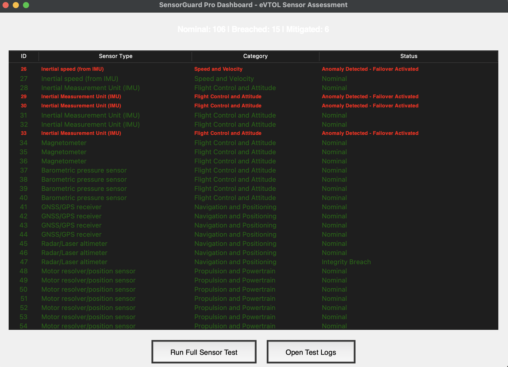

# SensorGuard Pro

**Prototype Cybersecurity Assessment Tool for eVTOL Aircraft Sensors**

A standalone Python application that simulates and assesses cybersecurity threats across ~162 redundant sensors in an eVTOL (electric vertical takeoff and landing) aircraft.

## Features
- Realistic simulation of 162 sensors with redundancy (e.g., IMUs, LIDAR, pitot tubes)
- Automatic breach injection (spoofing, tampering, anomalies)
- Implements a 5-phase cybersecurity methodology (Identify, Protect, Detect, Respond, Recover)
- Interactive Tkinter GUI dashboard with color-coded alerts (red for breaches)
- Detailed logging for forensic analysis

## How to Run (macOS/Python 3.12+)
1. Clone the repo: `git clone https://github.com/kleckie7/sensorguard-pro.git`
2. `cd sensorguard-pro`
3. Create venv: `python3 -m venv venv && source venv/bin/activate`
4. Run: `python3 main.py`
5. Click "Run Full Sensor Test" to assess sensors

Breaches are random (~10%) for demo purposes.

## Future Enhancements
- Real hardware integration (e.g., ARINC 429 bus)
- Machine learning for advanced anomaly detection
- Compliance with aviation cybersecurity standards (DO-326A)

**January 2026 Prototype** — Built as a portfolio project exploring advanced air mobility security.

Feedback welcome! 🚁🔒